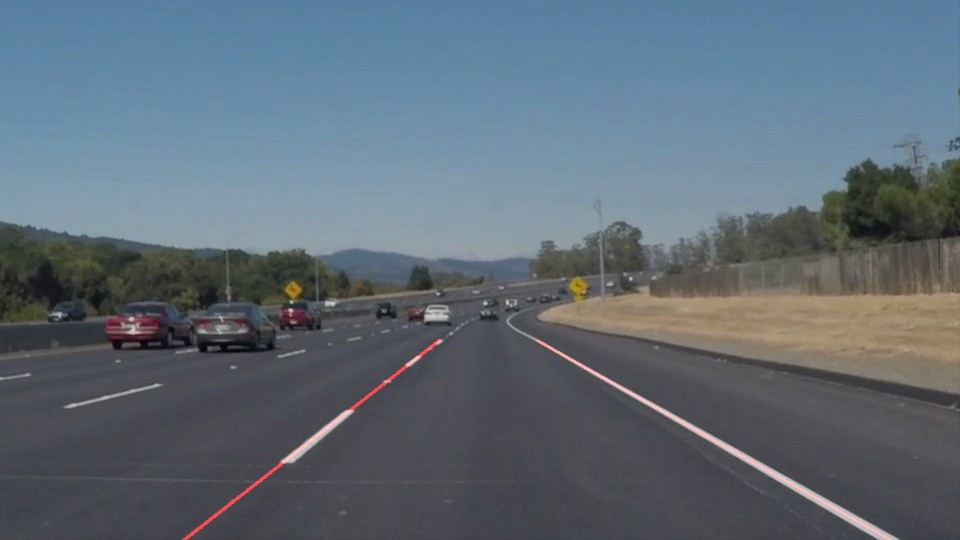
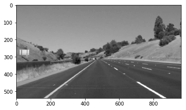
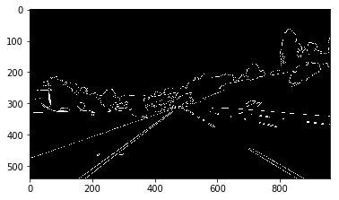
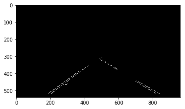

# **Finding Lane Lines on the Road** 

**Finding Lane Lines on the Road**

The goals / steps of this project are the following:
* Make a pipeline that finds lane lines on the road
* Reflect on your work in a written report

### Input

### Output

---

### Reflection

### 1. Describe your pipeline. As part of the description, explain how you modified the detect_lines() function.

My pipeline consisted of 7 steps. 

1. I reduced the amount of channels of the image from 3 to 1. Essentially turning it into grayscale. This helped optimize and increase the throughput of the lane detection, as we only have to compute for 1 channel instead of 3.

2. I applied some gaussian blur (of 5x5 kernel), which reduced the amount of noise in the image.

3. I, then applied the canny algorithm with thresholds of 50 and 150, essentially having a ratio of 1:3, which is a recommendation made by John Canny. Applying canny allowed me to trace the edges in the image.

4. After applying the canny algorithm, I used a triangular mask to filter out the unwanted lines and focus on the region-of-interest (ie: the lanes).

5. Next, I used the hough transform to find the straight lines in the region-of-interest. These lines drawn as lines in Image space are represented as points in Hough Space for Slope vs Y-intercept and points in the Image space are represented as lines in Hough Space. This allows us to choose lines in hough space which are intersecting at a given point and we can set a threshold, such that there's a minimum amount of intersection that needs to happen before we select a line.

6. Once, I selected the lines using hough transform, I averaged the lines on the left and right side of the images so that we see an average line of all the possible lines (something like the resonance hybrid from chemistry).

7. Now, using weighted_img function, I merged these lines with the orignal image.

### 2. Identify potential shortcomings with your current pipeline

1. As this is a very basic algorithm, it doesn't work very well with the optional challenge.
2. As this is written in python, running this is in production will cause a lot of performance issues, especially with videos
3. There's a tiny offset in the predicted lane line which differs from the actual lane line.
4. It doesn't in conditions, where we are very close to either side of the road.

### 3. Suggest possible improvements to your pipeline

1. A potential improvement could be done with the mask, which can be more accurate.
2. The hough transform parameters could be tweaked a bit to get a better result.
